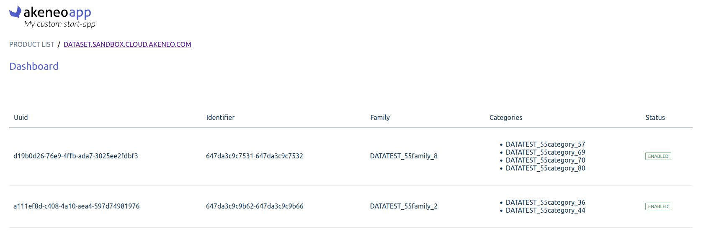

# DSM App Node JS + React

## Requirements
- You’ve got a PIM developer sandbox. If not, please contact us ([https://www.akeneo.com/contact/](https://www.akeneo.com/contact/))
- You’ve installed Docker (20.10.22 or higher)
- You’ve installed Docker Compose V2 plugin (see the official installation tutorial [here](https://docs.docker.com/compose/install/))

### Step 1: Get this App on your local machine
Get the whole Sample-Apps repository and navigate to the Node JS Express start app folder
```
git clone git@github.com:akeneo/sample-apps.git
cd samples/dsm/akeneo-dsm
```

### Step 2 (optional): Create a tunnel to expose your local App
Use [ngrok]([https://ngrok.com/](https://ngrok.com/)) to create a tunnel that allows your App to be accessed using a unique HTTPS URL. You need to create a ngrok account and auth token to preview your App.
```
ngrok http 8081
```
We recommend to generate an [authtoken](https://dashboard.ngrok.com/get-started/your-authtoken) too, if you don't do it at the beginning, you need to restart the installation and connection process.

If everything goes well the command will output your public URL for your local App :


### Step 3: Declare your local App as a test App in your sandbox to generate credentials
1. In your sandbox go to Connect > App store > Create a test App
2. Paste your callback & activation URLs
```
Name: [My App]
Activate URL: [your-url]/activate
Callback: [your-url]/callback
```


The App generates the credentials. Copy them for later.


### Step 4: OpenID Connect

OpenID Connect is a simple identity layer on top of the OAuth 2.0 protocol, implemented in Akeneo PXM Studio to authenticate users.
This is an optional feature in Apps, you can also use your own Authentication. To learn more, check the [documentation](https://api.akeneo.com/apps/authentication-and-authorization.html#getting-started-with-openid-connect).

Next step will let you choose whether you want to use this feature in your app, or not.
OpenId related code is clearly identified within the app to allow a fast and easy modification.

### Step 5: Launch your App
Open a terminal at the root of the folder of your App, enter the following command and let us guide you
```
make install
```
For information, this command launch scripts locate into `common/bin/install` in the root folder:

- [checkRequirements.sh](https://github.com/akeneo/sample-apps/blob/main/common/bin/install/checkRequirements.sh)
- [dotEnvFileCreator.sh](https://github.com/akeneo/sample-apps/blob/main/common/bin/install/dotEnvFileCreator.sh)

### Step 6: Activate your test App for your sandbox
1. Back in your sandbox go to Connect > App store
2. You see your App in the section “My App”
   

3. Click on CONNECT
4. Follow the activation process steps until the end

### Step 7: Launch your DSM App
Open a terminal at the root of the folder of your App, enter the following command :
```
make start
```

Then go to your favorite browser and enter the following URL
```
localhost:3000
```

If everything goes well, you should see the following page


### Step 8: Launch the tests
Open a terminal at the root of the folder of your App, enter the following command :
```
make tests
```

### Step 9: Add new components to your App
You can add new components to your App by following this link to the [Akeneo DSM](https://dsm.akeneo.com/?path=/story/introduction--page), enjoy!

### Update the access scopes

If a user updates the access scopes of an already connected app, the access scope update process will require app users to provide consent for the addition of new scopes. You can notify the PIM that the app requires an authorization update using this endpoint:

```
[your-url]/notify-authorization-update
```

### What's next?
- Want to get your PIM data to your App? Have a look to our [guided tutorials](https://api.akeneo.com/tutorials/homepage.html#tags=App%20Workflow)
- Need some tools? Have a look to our [dedicated page](https://api.akeneo.com/apps/app-developer-tools.html): we have, with others, a Postman collection that may you during your development.

[Tell us what you think!](https://surveys.hotjar.com/32725155-b355-4f87-b500-b505158d8e37)https://surveys.hotjar.com/32725155-b355-4f87-b500-b505158d8e37
